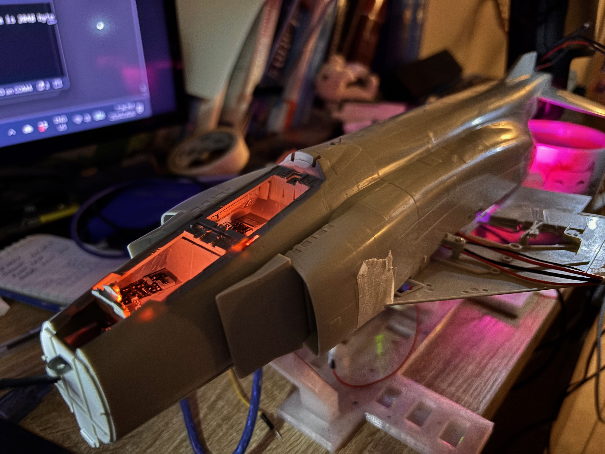
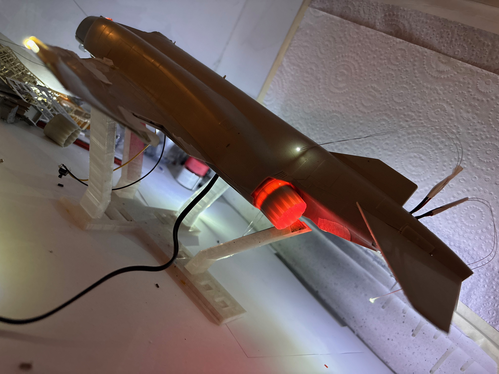
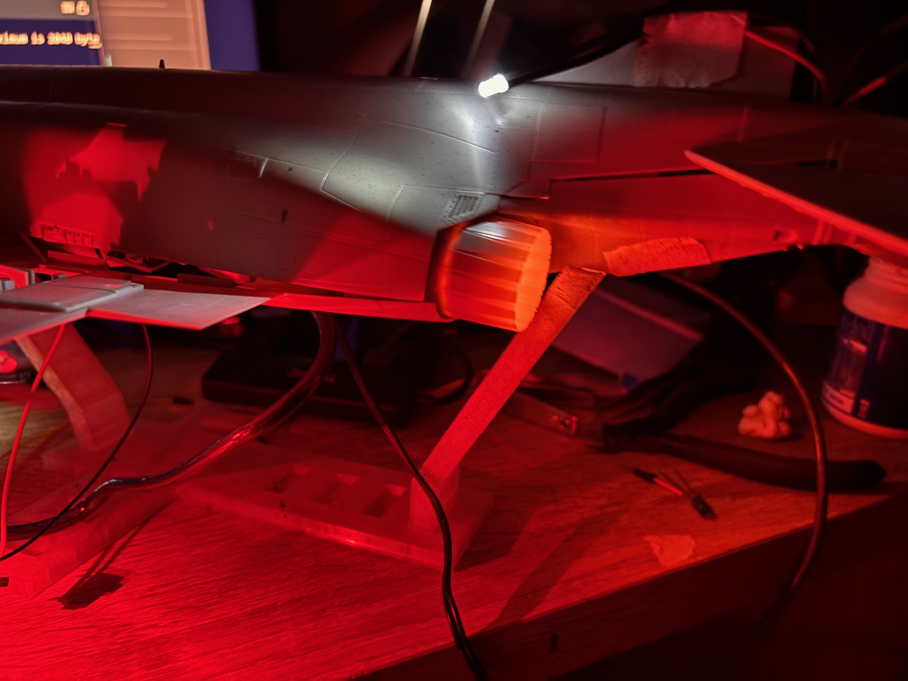
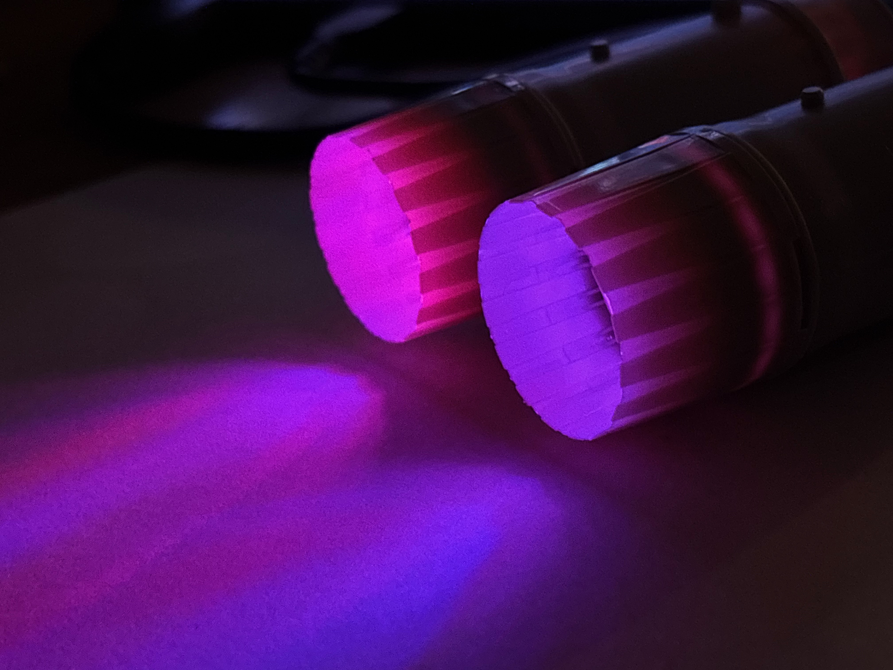

# F-4 Phantom (J79) Lighting Simulator

### Scott Douglass, May 2026. Use and Enjoy. 

An Arduino-driven lighting rig for a Tamiya 1/32 F-4E Phantom II scale model.
What started as basic cockpit lighting grew into a full, unattended flight
lighting sequence that simulates a pair of J79 turbojets — from engine start
through taxi, takeoff, cruise, a simulated combat/battle-damage event,
return, and shutdown — all triggered by a single push button.

Working build in action: https://www.youtube.com/shorts/Dx7I5_5_uy8

Sketch: [f4-flight-v1.ino](f4-flight-v1.ino) — April 2026.

## Gallery

 
 

Lit cockpit and afterburner cans during bench testing, before final
assembly onto the display stand.

Two bench-test clips of the sequence running: [IMG_1889.mov](assets/IMG_1889.mov), [IMG_1901.mov](assets/IMG_1901.mov)
(GitHub's file viewer plays these directly; click through to watch, or see the
[full flight video](https://www.youtube.com/shorts/Dx7I5_5_uy8) up top.)

## What it does

One press of the flight button runs the entire sequence hands-free:

1. **Startup** — cockpit light flickers on, then radome, nav, and beacon
   lights come up one at a time on a pre-flight checklist.
2. **Preflight lights check** — join-up and landing lights cycle on/off.
3. **Beacon on** — rotating red anti-collision beacon starts.
4. **Engine 1 / Engine 2 start** — each J79 "lights off": blue core glow
   ramps up, then the red can flares to full brightness, then yellow ramps
   in as red settles back to a steady idle glow.
5. **Military power test** — both engines briefly pushed to full power.
6. **Taxi out** — landing light dimmed to taxi setting.
7. **Takeoff** — full landing light and military power, join-up light for
   the climb-out.
8. **Flight** — level cruise at military power.
9. **Combat** — nav/beacon lights doused, join-up light flashes
   intermittently to simulate a wingman.
10. **Damage check** — left engine sputters and flames out, every system
    flickers and fails, goes fully dark, then reboots system by system
    before the left engine re-lights.
11. **Return / Approach / Taxi in** — nav and landing lights back on for
    the flight home and landing.
12. **Shutdown** — engines spool down, a lingering "hot start" glow fades
    over 20 seconds, a dying-ember flicker, and a final slow afterglow fade
    to fully cold.

Pressing the button again at any point mid-sequence aborts and runs the
shutdown/all-off sequence instead of continuing.

## Lighting channels

| Function | Pin | Notes |
|---|---|---|
| Left engine red can | 9 | PWM |
| Right engine red can | 10 | PWM |
| Left engine yellow can | 5 | PWM |
| Right engine yellow can | 3 | PWM |
| Engine core (blue shimmer) | 11 | PWM |
| Nav (position) lights | 4 | digital |
| Join-up light | 8 | digital |
| Red anti-collision beacon | 2 | digital, software-faked PWM |
| White anti-collision beacon | 12 | digital |
| Dorsal strobe | A1 | digital |
| Intake strobe | A2 | digital |
| Cockpit light | A3 | digital |
| Landing/taxi light | 6 | PWM |
| Radome/refuel light | A5 | digital |
| Flight button | A4 | INPUT_PULLUP, active LOW |

The engine glow and beacon are animated with a mix of sine-wave motion and
randomized jitter to avoid a mechanical, repeating look — tuning knobs for
brightness ranges and timing all live as named constants near the top of
the sketch.

## Hardware

- Arduino (any board with enough PWM-capable + digital pins for the table
  above)
- LEDs for each channel listed, wired to their pins (with appropriate
  current-limiting resistors)
- A momentary push button between `FLIGHT_BUTTON` (A4) and GND

## Usage

1. Flash `f4-flight-v1.ino` to the Arduino.
2. Wire the LEDs and button per the pin table above.
3. Power up — all lights start off.
4. Press the flight button to run the full sequence; press again anytime
   to abort back to shutdown.

## Author

Built by [Scott Douglass](https://github.com/Synaptechlabs) — [Synaptechlabs](https://github.com/Synaptechlabs).
